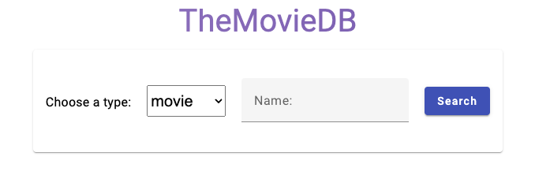
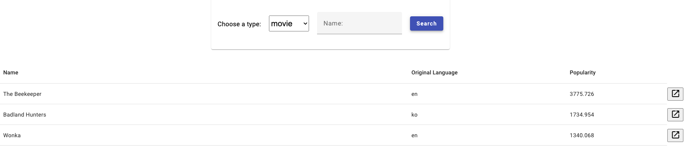
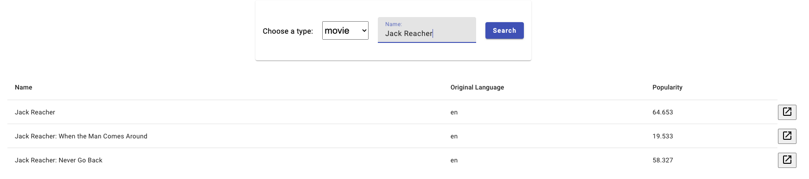
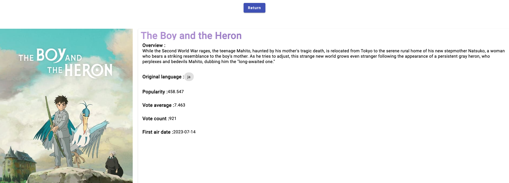

# film-view

It is an application that displays the list of movies or TV shows interacting with the API https://api.themoviedb.org/3

## Getting started

Make sure you have the Angular CLI installed globally. Install the cli using `npm` with this command : `npm install -g @angular/cli`

### Building 🔧

Run `npm install` to install all the depedencies of the project. If it doesn't work, retry again with `--force`.

Run `ng build` to build the project. 

### Starting ▶️

Run `ng serve` for a dev server. Navigate to http://localhost:4200/. The app will automatically reload if you change any of the source files.

### Testing ✅

Command `ng test` will execute all unit tests inside the project

### Functionnality overview 🖥️

- Homepage :

- Display a list of films or tv shows if user does not input any name. In this case, the endpoint `/discover` will be used 

- If the user enter a name in the Name input, then the endpoint `/search` will be used to find all results corresponding to the input text

- By clicking on the button at the end of the line, User can display the details of the selected movie. On that page, User can return to the homepage by clicking on the button Return.

